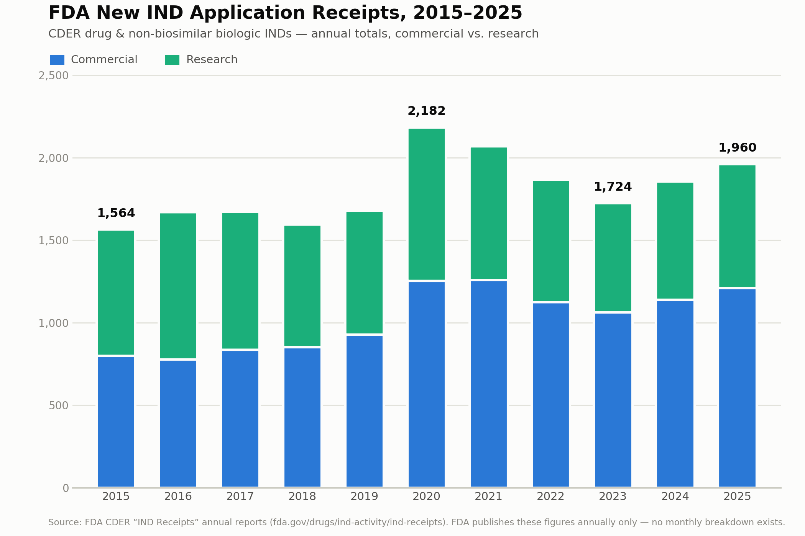

# FDA IND Trends (2015–2025)

Tracks FDA CDER's annual **new Investigational New Drug (IND) application receipts** for drugs and non-biosimilar biologics, 2015–2025.

## Key finding: growth is modest, not dramatic

Total new IND receipts grew from 1,564 (2015) to 1,960 (2025) — **+25% over 10 years, a ~2.3% CAGR**. The trend is not a steady climb: a COVID-era spike in 2020–2021 (+30% in 2020 alone) was followed by a pullback through 2023 (biotech funding slowdown), with 2024–2025 recovering to a new high that's only marginally above the 2020 peak.

| Year | Commercial | Research | Total | YoY |
|---|---|---|---|---|
| 2015 | 799 | 765 | 1,564 | — |
| 2016 | 777 | 892 | 1,669 | +6.7% |
| 2017 | 836 | 836 | 1,672 | +0.2% |
| 2018 | 852 | 742 | 1,594 | −4.7% |
| 2019 | 928 | 750 | 1,678 | +5.3% |
| 2020 | 1,253 | 929 | 2,182 | +30.0% |
| 2021 | 1,259 | 809 | 2,068 | −5.2% |
| 2022 | 1,124 | 741 | 1,865 | −9.8% |
| 2023 | 1,062 | 662 | 1,724 | −7.6% |
| 2024 | 1,139 | 716 | 1,855 | +7.6% |
| 2025 | 1,210 | 750 | 1,960 | +5.7% |

## Data

[`data/cder_ind_receipts_2015_2025.csv`](data/cder_ind_receipts_2015_2025.csv)

## Source and important caveats

Source: FDA CDER ["IND Receipts" annual reports](https://www.fda.gov/drugs/ind-activity/ind-receipts), one PDF per calendar year.

- **FDA does not publish IND data at monthly granularity.** These reports are annual totals only — there is no monthly time series in FDA's public data.
- **FDA does not publish individual IND numbers.** INDs are confidential sponsor filings; FDA does not "approve" them in the way NDAs/BLAs are approved (they take effect automatically after 30 days absent a clinical hold).
- Figures exclude biosimilar biologic INDs, expanded access INDs, and CBER-regulated biologics — those are tracked in separate FDA reports.
- "Receipts" = new INDs submitted that year. A broader FDA metric, "INDs with Activity" (new INDs + existing INDs with any incoming correspondence that year), was 15,124 for 2025 — not a comparable series since it captures a different population.
